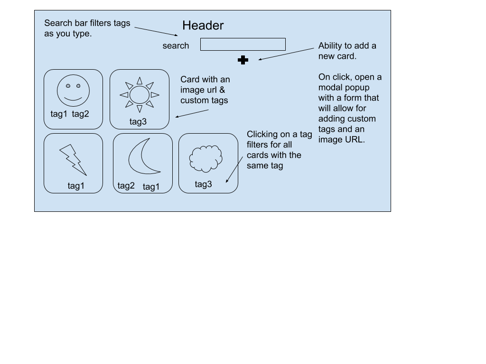

# Introduction

## What we're going to build
The goal of this project it to create a "pinboard" of images that you can collect, categorise with tags and reflect on later.

You will be able to create new cards with custom tags, and then filter tags via the search bar or by clicking on a tag.

Before we jump into the code, let's start by creating a wireframe to plan the layout and functionality of our project.



This will be a single-page website with a header, a search bar and an "add card" button.

Some initial card data is stored in a .json file, which will be displayed by default. Each card has a unique image url, as well as custom, user generated tags. Clicking on a tag should filter through all the cards to display only the cards that contain the same tag. Using the search bar should also filter through the tags and display only the relevant cards.

To add a new card, a modal will pop up wich will allow the user to enter an image url and custom tags.


HTML basics
We'll start off with a basic HTML skeleton, hard-coding the elements in our wireframe, which we are going to populate with data later on in this tutorial. You may find it useful to start adding your class names to each element, since we'll need this later when adding our styling. 

```
<html>
  <head>
    <meta charset="utf-8" />

    <title>My Moodboard</title>

    <link rel="stylesheet" href="style.css" />
    <link rel="preconnect" href="https://fonts.gstatic.com" />
    <link
      href="https://fonts.googleapis.com/css2?family=Bungee+Shade&family=Montserrat:wght@300&display=swap"
      rel="stylesheet"
    />
  </head>

  <body>
    <h1 class="header">My Moodboard</h1>
    <div class="searchContainer">
      <label class="searchLabel">search</label>
      <input
        class="searchInput"
      />
      <p class="searchResult"></p>
      <button class="newCardButton">Add a card</button>
    </div>
    <div class="cardContainer"></div>
    <div class="modal">
      <div class="modal-content">
        <span class="close">&times;</span>
        <form>
          <label>Image source</label>
          <input
            class="newCardInput"
          />
          <label>Tags</label>
          <input
            class="newCardInput"
          />
          <button class="submitButton">
            Submit
          </button>
        </form>
      </div>
    </div>
  </body>
</html>```


## CSS

```/* Main styles */
html {
  font-family: "helvetica neue", helvetica, arial, sans-serif;
}

body {
  width: 80rem;
  margin: 0 auto;
  background-color: #f4b0b0;
}

/* Header */

h1 {
  font-size: 4rem;
  text-align: center;
  font-family: "Bungee Shade", cursive;
  color: #fc47bb;
  text-shadow: 0 0 5px #fc47bb;
}

/* Search Bar */

.searchContainer {
  margin: 0 auto;
  text-align: center;
}

.searchLabel {
  font-size: 1.2rem;
  font-family: "Montserrat", sans-serif;
  margin: 0 0.2rem;
}

.searchInput {
  height: 2rem;
  width: 25rem;
  box-shadow: 0 0 5px #fc47bb;
  font-family: "Montserrat", sans-serif;
  margin: 0 0.2rem;
}

.searchResult {
  font-family: "Montserrat", sans-serif;
}

/* New card button */

.newCardButton {
  font-family: "Montserrat", sans-serif;
  font-size: large;
  margin: 0 0.2rem;
}

/* Card contents */

.cardContainer {
  display: flex;
  max-width: 80rem;
  justify-content: center;
  flex-wrap: wrap;
  width: 80rem;
  margin: 1rem;
}

img {
  max-width: 25rem;
  max-height: 30rem;
  border-radius: 5px 5px 0 0;
}

.card {
  background-color: #f7c5c5;
  margin: 0.5rem;
  max-width: 30rem;
  box-shadow: 0 4px 8px 0 rgba(0, 0, 0, 0.2);
  transition: 0.3s;
  border-radius: 5px;
}
.tagContainer {
  display: flex;
  justify-content: center;
}
.tagButton {
  text-shadow: 0 0 5px #fc47bb;
  font-family: "Montserrat", sans-serif;
  font-size: medium;
  margin: 0.5rem;
}

/* Modal background */
.modal {
  display: none; 
  position: fixed; 
  z-index: 1; 
  padding-top: 100px; 
  left: 0;
  top: 0;
  width: 100%; 
  height: 100%; 
  overflow: auto; 
  background-color: rgb(0, 0, 0);
  background-color: rgba(0, 0, 0, 0.4); 
}

/* Modal Content */
.modal-content {
  background-color: #fefefe;
  margin: auto;
  padding: 20px;
  border: 1px solid #888;
  width: 50%;
}

/* Close Button */
.close {
  color: #aaaaaa;
  float: right;
  font-size: 28px;
  font-weight: bold;
}

.close:hover,
.close:focus {
  color: #000;
  text-decoration: none;
  cursor: pointer;
}

/* Form Inputs */
.newCardInput,
select {
  width: 100%;
  padding: 12px 20px;
  margin: 8px 0;
  display: inline-block;
  border: 1px solid #ccc;
  border-radius: 4px;
  box-sizing: border-box;
}

/* Submit button */
.submitButton {
  width: 100%;
  background-color: #fc47bb;
  color: white;
  padding: 14px 20px;
  margin: 8px 0;
  border: none;
  border-radius: 4px;
  cursor: pointer;
}

.submitButton :hover {
  background-color: #b92985;
}```

## Javascript 

```<script>
      const cardContainer = document.querySelector("cardContainer");
      let cards = [];
      fetch("pins.json")
        .then(function (response) {
          return response.json();
        })
        .then(function (data) {
          cards = data;
          appendData(cards);
        })
        .catch(function (err) {
          console.log(err);
        });

      function appendData(data) {
        var cardContainer = document.getElementById("cardContainer");
        cardContainer.innerHTML = "";

        for (var i = 0; i < data.length; i++) {
          var card = document.createElement("div");
          card.className = "card";
          cardContainer.appendChild(card);

          var img = document.createElement("img");
          img.src = data[i].src;
          card.appendChild(img);

          var tagContainer = document.createElement("div");
          tagContainer.className = "tagContainer";
          card.appendChild(tagContainer);
          const tagButtons = data[i].tags.map((tag) => {
            const tagButton = document.createElement("button");
            tagButton.onclick = () => {
              const filteredCards = cards.filter((card) => {
                return (
                  card.tags.find((tag) => {
                    return tag.includes(tagButton.innerHTML);
                  }) !== undefined
                );
              });
              appendData(filteredCards);
            };
            tagButton.innerHTML = tag;
            return tagButton;
          });
          for (const tagButton of tagButtons) {
            tagButton.className = "tagButton";
            tagContainer.appendChild(tagButton);
          }
        }
      }
      function filterTags() {
        var searchTerm = document.getElementById("searchInput").value;
        document.getElementById("searchResult").innerHTML =
          "You searched for: " + searchTerm;
        const searchTermLower = searchTerm.toLowerCase();
        const filteredCards = cards.filter((card) => {
          return (
            card.tags.find((tag) => {
              const tagLower = tag.toLowerCase();
              return tagLower.includes(searchTermLower);
            }) !== undefined
          );
        });
        appendData(filteredCards);
      }
      function saveNewCard() {
        var newImgSrc = document.getElementById("imgsrc").value;
        var newTags = document.getElementById("tags").value.split(";");
        var lastCardId = cards[cards.length - 1].id;
        var newCard = {
          id: lastCardId + 1,
          src: newImgSrc,
          tags: newTags,
        };
        cards = [...cards, newCard];
        appendData(cards);
        newCardModal.style.display = "none";
      }
      var newCardButton = document.getElementById("newCardButton");

      var newCardModal = document.getElementById("newCardModal");
      newCardButton.onclick = function () {
        newCardModal.style.display = "block";
      };

      var closeModal = document.getElementsByClassName("close")[0];
      closeModal.onclick = function () {
        newCardModal.style.display = "none";
      };
      window.onclick = function (event) {
        if (event.target == newCardModal) {
          newCardModal.style.display = "none";
        }
      };
    </script>
    ```

### Additional reasources

Google Fonts: https://fonts.google.com/

